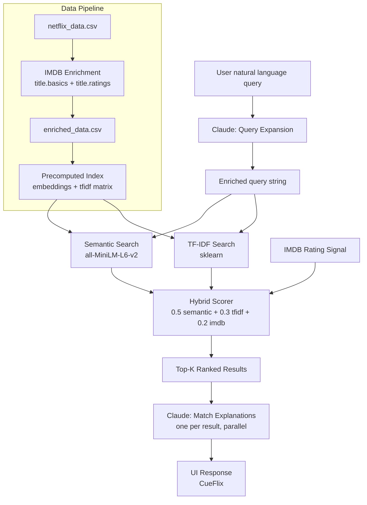

# CueFlix — AI-Powered Movie Recommender

> Describe what you're in the mood for. CueFlix finds the match.

## Quickstart

Set your Anthropic API key before running:

```bash
export ANTHROPIC_API_KEY=sk-ant-...
```

Then run the app:

```bash
docker build -t movie-recommender .
docker run -p 8080:80 -e ANTHROPIC_API_KEY=$ANTHROPIC_API_KEY movie-recommender
```

Open [http://localhost:8080](http://localhost:8080).

---

## AI Setup

| Setting | Value |
|---|---|
| Provider | Anthropic |
| Model | claude-sonnet-4-6 |
| Usage | Query expansion + per-result match explanations |

The reviewer must set `ANTHROPIC_API_KEY` as shown above before running.

---

## Architecture



---

## Approach

### Why hybrid retrieval?

A single retrieval method has blind spots. TF-IDF is precise on keywords but misses synonyms and mood language. Semantic embeddings understand "something cozy and funny" but can miss exact genre or actor matches. IMDB ratings prevent high-scoring obscure content from outranking beloved titles. Combining all three into a weighted score gives consistently better results than any single method.

### How natural language queries are handled

Raw queries are not fed directly into retrieval. Instead, Claude first reads the query and expands it into a rich descriptive paragraph — extracting mood, genre signals, tone, and any specific preferences mentioned. For example:

- Input: `"something intense like Breaking Bad"`
- Expanded: `"Dark, slow-burn crime drama with morally complex antiheroes descending into the criminal underworld. High-stakes storytelling with escalating tension and devastating consequences..."`

This expanded string is then used for both semantic and TF-IDF retrieval, dramatically improving match quality on vague or conversational queries.

### Match explanations

After retrieval, Claude generates a one-sentence explanation for each result describing specifically why it matches the user's query. This runs in parallel across all results to minimize latency.

### Data enrichment

The provided Netflix CSV is enriched at build time with IMDB's public datasets (`title.basics` + `title.ratings`), matched on title and release year. 62.4% of titles were successfully matched, adding IMDB ratings, vote counts, and genre data that meaningfully improves ranking.

---

## Stack

| Component | Technology |
|---|---|
| Backend | FastAPI + Uvicorn |
| Semantic embeddings | sentence-transformers (all-MiniLM-L6-v2) |
| TF-IDF | scikit-learn |
| LLM | Anthropic Claude (claude-sonnet-4-6) |
| Data enrichment | IMDB public datasets |
| Container | Docker |

---

## Demo

**Query:** `"oscar winner"`

**Filters:** Movies & Shows · 8+ IMDB · 10 results

)
